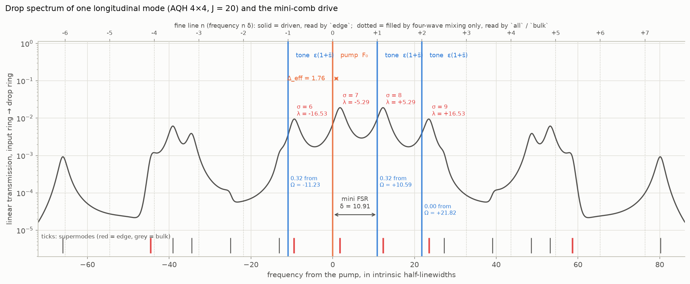
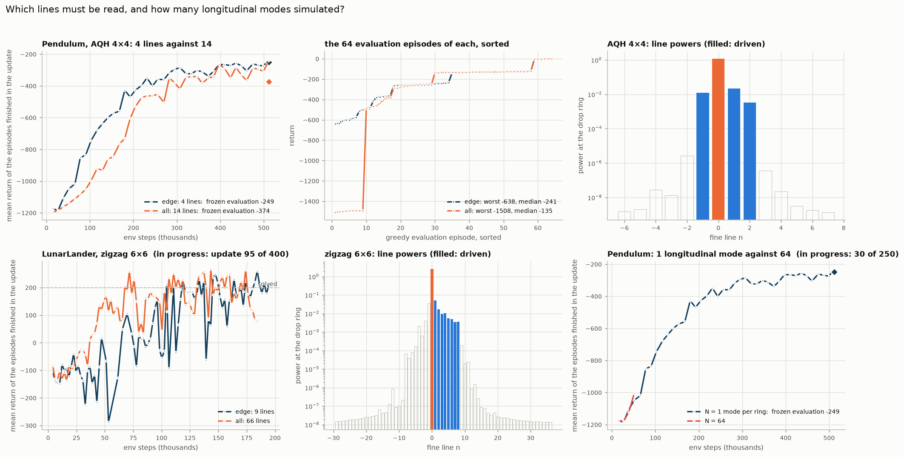

# The coupled-ring lattice extension

This note documents what was added to the single-ring repository: a 2D lattice of coupled Kerr
microrings whose **edge supermodes, inside one longitudinal mode, carry the inputs** — a mini-comb —
used as the policy's feature map in place of the single ring. It covers the idea, the model, the
implementation, how it was validated, and the first results.

## Why

The single ring establishes the principle with its longitudinal modes as channels: one input per
comb line, read-out of the comb lines. But those lines are one FSR apart — of the order of a THz
for a microring — far beyond what a modulator can write or a detector resolve directly. This is
what the lattice is for: inside ONE longitudinal mode sit its R supermodes σ (eigenvalues λ_σ of the
coupling matrix H), the edge supermodes of a topological lattice are nearly equidistant, and their
spacing is set by the ring-ring coupling, i.e. it is of the order of a GHz. Replacing "longitudinal
modes, one FSR apart" by "edge supermodes, one mini FSR apart" brings the same scheme into the
range of ordinary electronics: for a linewidth κ/2π = 200 MHz the numbers below (J = 20, δ = 10.9)
mean a coupling of 2 GHz, a mini FSR of 1.1 GHz and four read-out lines within 3.3 GHz, so that one
modulator writes all tones and a heterodyne measurement of the drop port reads all lines.

## The model (`microring/lattice.py`)

Each of the R rings carries longitudinal modes m; rings are coupled site-to-site by a tight-binding
Hamiltonian H that is the same for every longitudinal mode:

$$\partial_t a_{r,m} = \left[-(1+i\Delta) - i d_2 m^2\right] a_{r,m} - i\sum_{r'} H_{rr'} a_{r',m} - \kappa_{ex,r} a_{r,m} + i(|\psi|^2\psi)_{r,m} + F_{r,m}$$

in the units of the single-ring LLE: time in photon lifetimes 2/κ_in, so the intrinsic loss rate is
1 and every other rate (J, κ_ex, Δ, δ) is in units of the intrinsic half-linewidth. κ_ex is the extra
loading of the rings that carry a bus coupler (the input ring and the drop ring).

Three lattices, with the conventions of the standalone
[Topological Photonic Lattice Explorer](https://github.com/lidaxu-physics/Topological_Photonics_Nonlinear_Explorer)
(the test compares the matrices element by element):

* **`H_IQH`** — integer-quantum-Hall analogue (Hafezi lattice): a uniform synthetic flux per
  plaquette, chiral edge states.
* **`H_AQH`** — anomalous-quantum-Hall (Haldane-type) analogue: staggered phases plus
  same-sublattice diagonal hoppings; its edge band sits at the band centre.
* **`H_zigzag`** — the AQH lattice cut with zigzag edges, R = nx(ny−1) + ny(nx−1) rings. Its edge
  band is more linear: many more, and more evenly spaced, edge supermodes for its size.

**The drive: a mini-comb inside one longitudinal mode.** The pump sits on one edge supermode σ_p and
one tone on each of d others, all in the longitudinal mode m = 0 and all entering the same corner
ring:

$$F_{r,m}(t) = \delta_{r,\mathrm{in}}\delta_{m,0}\left[F_0 + \sum_k \varepsilon(1+\tilde s_k)e^{-i n_k\delta t}\right]$$

with n_k = σ_k − σ_p and δ the **mini FSR**. This is the equidistant drive of the single ring with
the FSR replaced by δ.



The figure (`characterization/05_mini_comb_drive.py`) shows every quantity of this formula for the
preset, on the linear drop spectrum of the pump's longitudinal mode — the transmission from the
input ring to the drop ring of a weak probe at frequency ω from the pump,
|[(1 + i(Δ − ω)) + κ_ex + iH]⁻¹|² taken between those two rings. The ticks at the bottom mark where
each of the 16 supermodes is resonant (red: edge supermodes, ≥ 85 % of their weight on the boundary
rings; grey: bulk). The top axis counts the fine lines n δ that can be read: the solid ones are
driven, the dotted ones can only be filled by four-wave mixing.

1. **Supermodes σ, eigenvalues λ_σ.** Diagonalise H; σ numbers its eigenvalues in ascending order
   (`supermode_table()` also lists boundary weight and port overlaps). Supermode σ is resonant at
   ω = Δ + λ_σ: these are the peaks. The four in the figure are the edge supermodes σ = 6, 7, 8, 9
   of the AQH 4 × 4 lattice, λ = −16.53, −5.29, +5.29, +16.53 at J = 20.
2. **Pump supermode σ_p and detuning Δ.** σ_p is the edge supermode the input ring couples to best
   (here σ_p = 7; `--pump_sigma` overrides). Δ is then set so that this supermode sits at
   Δ_eff = Δ + λ_σp = 1.76: the pump (orange, ω = 0) is 1.76 half-linewidths to the red of its
   peak. Here Δ = 1.76 + 5.29 = 7.05.
3. **Tone supermodes σ_k and rungs n_k = σ_k − σ_p.** One of the remaining edge supermodes per
   input (here 6, 8, 9, so n = −1, +1, +2; `--tone_sigma` overrides). Their exact distances from
   the pump's supermode are Ω_k = λ_σk − λ_σp = −11.23, +10.59, +21.82.
4. **Mini FSR δ.** The Ω_k are only nearly multiples of one spacing. δ is the spacing that fits
   them best in the least-squares sense with the pump as rung 0, δ = Σ n_k Ω_k / Σ n_k²
   = (11.23 + 10.59 + 2 × 21.82) / 6 = 10.91. The tones (blue) are driven at n_k δ = −10.91, +10.91,
   +21.82, not at Ω_k: they miss their supermodes by |n_k δ − Ω_k| = 0.32, 0.32 and 0.00, a quarter
   of the loaded half-linewidth (1.2–1.3). Like the pump, each then sits about 1.76 to the red of
   its peak.
5. **Amplitudes.** F₀ is the pump amplitude; tone k has amplitude ε(1 + s̃_k), where s̃_k in [−1, 1]
   is the squashed k-th observation. All of them enter the input ring only (δ_{r,in}) and the
   longitudinal mode m = 0 only (δ_{m,0}).

By default the pump takes the edge supermode
the input corner couples to best (`--pump_sigma` overrides it) and the tones the neighbouring edge
supermodes that are most evenly spaced (`--tone_sigma`); supermodes that are not close to
equidistant — a tone more than 1 off its supermode — are refused. The pump's supermode is placed at
effective detuning Δ_eff = Δ + λ = 1.76 (`--Delta` overrides), so pump and tones are red-detuned
from their supermodes by 1.76 half-linewidths.

**Readout.** Only the output of the drop ring is used. Its field in the pump's mode, a(t), is
Fourier transformed over the averaging window, and the features are the powers of the lines n δ —
what a heterodyne measurement or a spectrometer with a resolution below δ gives at the drop port.
The frequencies are those of the drive: the drive is periodic (period 2π/δ), so below the comb
threshold the response is, too, and its lines can only sit at n δ. δ is rounded (by less than 1 %)
so that a period is a whole number of solver steps and of samples, and the window a whole number of
periods; the lines are then exactly orthogonal, and a held input gives the same features at every
call (to 1e−5). `--mini_comb` selects the lines:

* `edge` (default): the lines of the driven supermodes;
* `all`: every line in the band of H;
* `bulk`: the latter without the former, i.e. only light that four-wave mixing put there.

**One longitudinal mode is enough.** With pump and tones on m = 0 and the pump below the comb
threshold, the other longitudinal modes stay empty (exactly zero in a 64-mode simulation), so the
preset keeps one mode per ring (`--N` adds more).

**Integrator.** The exact-flow Strang splitting of `LLESolver`, with the linear + drive sub-flow now
a matrix ODE per longitudinal mode, `da_m/dt = L_m a_m + F_m(t)`, `L_m = c_m I − iH_aug`,
`H_aug = H − i·diag(κ_ex)`. One eigendecomposition of H_aug gives every propagator and the response
to a tone at frequency Ω exactly,

```
E_m(h) = V diag(exp(z h)) V⁻¹        W(h) = V diag((exp(z h) − exp(−iΩ h)) / (z + iΩ)) V⁻¹,   z = c_m − iλ
```

so the only error is the O(dt²) splitting error, which needs J·dt ≪ 1. The solver clock t (the
carrier phases of the tones) is part of the state of the lattice: checkpoints and `calibrate()`
save and restore it.

**Geometry.** Input is the corner ring (0, 0); the drop ring is the corner the edge current of the
selected band reaches: (nx−1, 0) for IQH, (0, ny−1) for AQH (it receives 8× the light of the IQH
corner at J = 5 and 1.8× at J = 20 on 4 × 4, where little is lost per round trip), the corner
(1, 2ny−1) for zigzag (3× the opposite one on 6 × 6). `--drop_site r` reads another ring.

## Which lattice for which task

One edge supermode per input plus one for the pump.

| lattice | rings | edge supermodes | spacing at J = 20 | enough for |
|---|---|---|---|---|
| AQH 4 × 4 | 16 | 4 (σ = 6…9) | 11.23, 10.59, 11.23 | Pendulum (3 inputs) |
| AQH 12 × 12 | 144 | 8 usable | 3.9–4.5 | CartPole (4) |
| zigzag 4 × 4 | 24 | 10 | 4.5–11.6 | Pendulum, CartPole |
| zigzag 6 × 6 | 60 | 10 (σ = 25…34) | 2.6–2.9 | LunarLander (8) |

The spacing shrinks with the perimeter and grows with J, so a larger lattice wants a larger J to
keep its supermodes resolved (loaded half-linewidth 1.1–1.3): zigzag 6 × 6 at J = 40 has δ = 5.4 and
its nine drive lines within 0.35 of their supermodes. The pump has to grow as well, because it
spreads over all boundary rings: at F₀² = 100 the pump line carries 1.1 per ring on the AQH 4 × 4
lattice but 0.29 on AQH 12 × 12 and less on zigzag 6 × 6, where the mixing products are then four
orders below the tone lines.

## The preset (`REGIMES["topo"]` in `microring/__init__.py`)

| parameter | value | why |
|---|---|---|
| lattice | AQH 4 × 4, flux π/4 | four edge supermodes: the pump and the three inputs of the pendulum |
| J | 20 | supermodes 10.6–11.2 apart against a loaded half-linewidth of 1.2–1.3: a tone has 84–92 % of its energy on the supermode it aims at |
| pump / tones | σ = 7 / 6, 8, 9 | n = −1, +1, +2; δ = 10.91, tones about 0.3, 0.3 and 0 from their supermodes |
| Δ | auto | the pump's supermode at Δ_eff = 1.76 |
| F₀², ε | 100, 0.6 | below the comb threshold; pump line 1.1, tone lines 0.01–0.02 at the drop ring |
| N | 1 | the other longitudinal modes stay empty |
| dt | 0.005 | J·dt = 0.1 |
| T_relax / T_avg | 3 / 10 | T_avg is rounded to whole periods of the mini-comb (17 periods, 9.78) |
| κ_ex | 1 | on the input ring and the drop ring |

64 lattices in parallel take 0.7 s per control step (2 s for 144 rings).

## First results

Pendulum on the preset, one seed, frozen greedy evaluation over 64 episodes:

| lines read | features | return | worst / best episode |
|---|---|---|---|
| `edge` | 4 | **−249 ± 175** | −638 / −2 |
| `all` | 14 | −374 ± 469 | −1508 / −1 |

For comparison: a linear policy reaches −718…−1038, the best single-ring regime −196…−252. So the
mini-comb computes — the swing-up is out of reach of a linear readout of the inputs — and the four
lines of the driven edge supermodes suffice; the ten further lines are 10⁻⁶ and below (three to four
orders under the tone lines), and the policy that reads them fails outright in 9 of 64 episodes
while doing better in the others (see the two questions below). Two cautions. This is one seed.
And the four `edge` lines sit at the drive frequencies, so they contain the linearly transmitted
tones as well as the mixing products: that they suffice does not by itself show where the
computation happens. In the simulation 99.5 % of the light is in the four edge supermodes and 99.9 %
on the boundary rings.

## Two questions the runs are meant to answer

**1. Is one longitudinal mode per ring enough?** The claim is that below the comb threshold the
light never leaves the pump's longitudinal mode, so that the other modes need not be simulated.

* *Physics.* In a 64-mode simulation of the preset, the power outside m = 0 is exactly zero after
  the warm-up, and the features computed with 1 and with 8 modes per ring agree to better than
  1e−3 (test 7). The reason: pump and tones are all on m = 0, and four-wave mixing among them
  conserves m; the only way out is modulational instability, which the pump is kept below.
* *Training.* The Pendulum run repeated with 64 modes per ring (same seed, otherwise identical) is
  in progress. Up to its 25th update it follows the single-mode run — returns −1180 and −1008
  against −1186 and −1049 at updates 13 and 25 — at six times the cost (137 s per update against
  23 s). The final evaluation will be added here.

So far: yes. The single mode is not an approximation below threshold; it is what the dynamics does.

**2. Must every line be read, or do the lines of the edge supermodes suffice?** `edge` reads the
lines at the drive frequencies (solid in the figure above), `all` every line n δ in the band of H.

| task, lattice | `edge` | `all` | status |
|---|---|---|---|
| Pendulum, AQH 4 × 4 | **−249 ± 175** (4 lines) | −374 ± 469 (14 lines) | frozen evaluation, 1 seed |
| LunarLander, zigzag 6 × 6 | ≈ +220 (9 lines) | ≈ +265 (66 lines) | training return at update 85 of 400, 5–10 episodes each |



(`characterization/06_two_questions.py` redraws the figure from the run files, and from the
checkpoints of runs still in progress.)

On the pendulum (top row) the four edge lines suffice: that policy learns faster (top left) and
never fails — its worst evaluation episode is −638. The policy that reads all 14 lines is not
simply worse, though (top middle). In 55 of its 64 evaluation episodes it is the better one
(median −135 against −241), and in the other 9 it never swings up (about −1500), which is what
pulls its mean to −374. The ten extra lines carry 10⁻⁶ and less (top right), three to four orders
below the tone lines: after standardisation they give the readout more to fit and, from some
initial conditions, more to go wrong with. One seed each, so the ranking of the means is not
settled; that four lines are enough to solve the task is.

On LunarLander (bottom left) both variants already land — a return above 200 counts as solved —
after a fifth of the training, with no clear difference between them; these are noisy training
returns, not evaluations. That lattice differs in a way that matters for this question (bottom
middle): it has ten edge supermodes of which nine are driven, and the lines just outside the driven
ones sit near further supermodes, so four-wave mixing fills them resonantly to 10⁻² – 10⁻³ of the
pump line, as strong as the tone lines themselves. There the extra lines are signal, not noise;
whether they help is what the two finished runs will show.

The bottom right panel is question 1: the 64-mode run on top of the single-mode one, as far as it
has got.

What `edge` sufficing does and does not mean: the edge lines sit at the drive frequencies and
contain the linearly transmitted tones as well as the mixing products. `--mini_comb bulk`, which
reads only lines that four-wave mixing fills, is the control that separates the two; it has not
been run yet.

`python animate_mini.py --env Pendulum-v1 --tag mini4_edge` replays one greedy episode from a
training checkpoint: the task, the training curve, the lattice, the linear drop spectrum of the
mode with the drive lines, the fine lines, and the share of the light on the edge
(`results/ppo/Pendulum/topo_pendulum*.gif`).

## Validation (`tests/test_lattice.py`)

1. `H_IQH` / `H_AQH` / `H_zigzag` are Hermitian and match the explorer's builders **element by
   element** (the test lifts the explorer's functions out of its source via `ast`; skipped if the
   explorer repo is absent).
2. Every propagator and drive-response matrix agrees with `torch.matrix_exp` to < 1e−12.
3. A 1 × 1 lattice reproduces the validated single-ring `LLESolver` trajectory to **round-off zero**
   over 500 chaotic steps.
4. Chiral edge transport: a corner-driven 8 × 8 IQH lattice keeps ~87 % of the steady intensity on
   the boundary rings, and the downstream corner receives ~7× the power of the mirror corner.
5. Zigzag 6 × 6: ten consecutive edge supermodes within 11 % of equidistant; its default drop corner
   receives 3× the power of the other.
6. AQH: the default drop corner (0, ny−1) receives ~7× the power of the IQH corner (8 × 8, J = 10).
7. Mini-comb: all-zero tone frequencies reproduce the time-independent drive to round-off; weak
   tones inside the pump's mode ring up to the analytic linear response (< 1e−8), each with > 80 %
   of its energy on the supermode it aims at; with the pump on, the integrator composes exactly
   and stays second order in dt; `make_ring` fits the mini FSR and rounds it to the sample grid;
   the features equal the Fourier components of the drop ring's field recomputed from a trace; a
   held input repeats (< 1e−3); the other longitudinal modes stay empty and `N = 1` gives the same
   features; `edge` and `bulk` are subsets of `all`; (state, clock) is the whole state of the
   lattice; the preset picks the pump's and the tones' supermodes by itself, also on the zigzag
   lattice; mistakes (the pump's supermode as a tone, supermodes far from equidistant, too few
   edge supermodes for the inputs, indices out of range, field detection) are refused.

`tests/test_ppo_clock.py` runs `PPO_MR.py` end to end (three tiny trainings in a temporary
directory): `--pump_sigma`, `--tone_sigma`, `--mini_comb`, `--drop_site`, `--dt` and `--N` reach
the lattice and the evaluation lattice, and the solver clock survives `calibrate()`, a checkpoint
and `--resume`.

The Benettin Lyapunov estimator in `microring/diagnostics.py` accepts lattice-shaped states (norm
over everything but the batch axis); single-ring behaviour is unchanged.

## What is not here (yet)

* **More seeds and the `bulk` control** for the Pendulum result, and the operating points of the
  larger lattices (pump power against the comb threshold).
* **Past the comb threshold**: the lattice then fills other longitudinal modes and the response is
  no longer periodic; the read-out above assumes it is.
* **Disorder robustness** — the fabrication-motivated test (random on-site detunings, topological
  vs trivial lattice at equal geometry). The solver supports it through the diagonal of H.
* Superlattice and cylinder geometries of the explorer.
