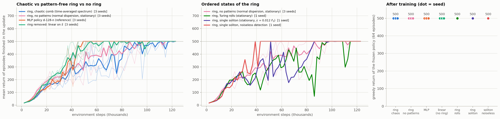
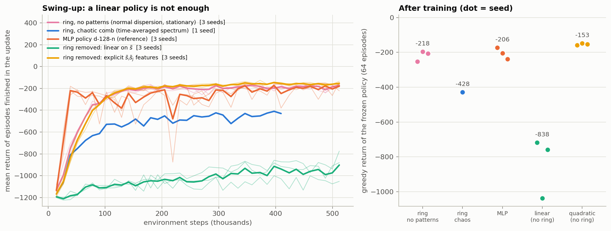
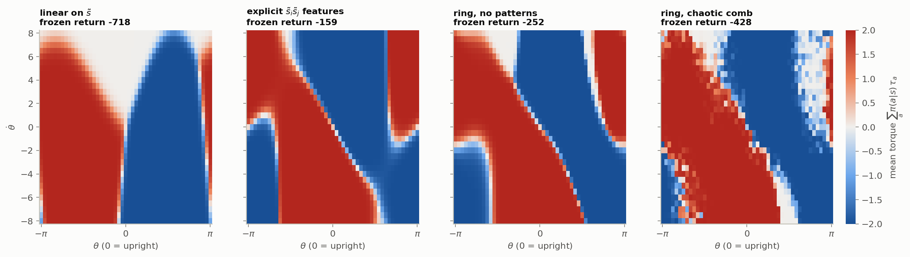
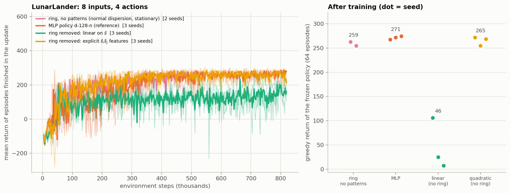
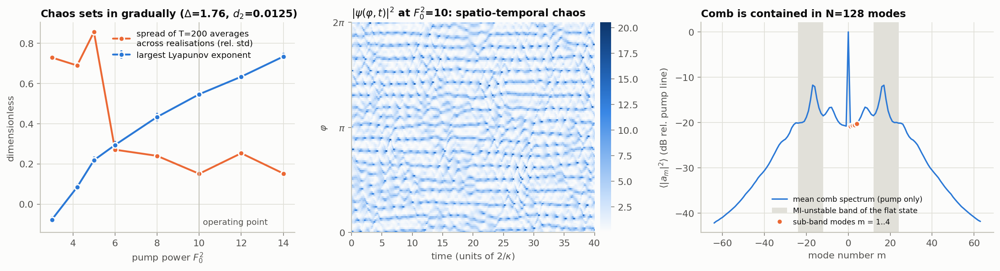
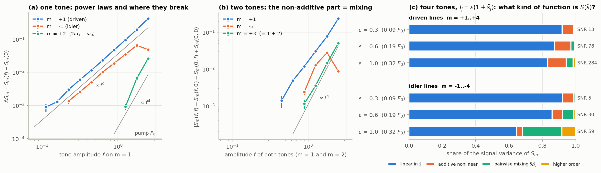
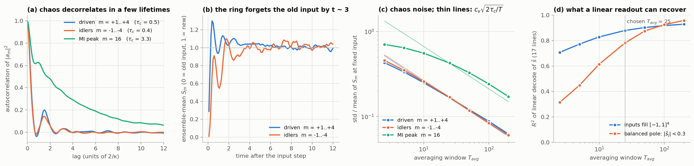
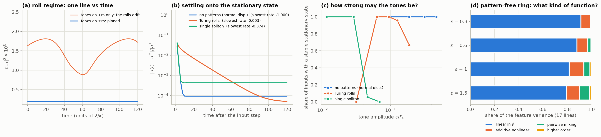
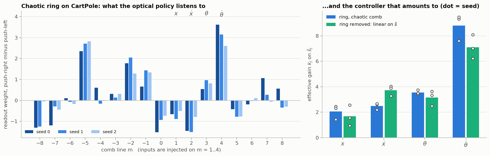
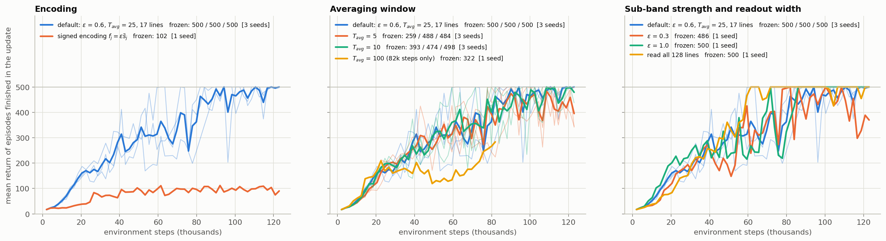

# aion-optical-RL

Reinforcement learning with an optical policy: PPO where the policy network is replaced by a **Kerr microring
resonator** (Lugiato–Lefever equation) followed by a single trainable linear layer.

```
obs s ──squash(s/scale)──► sub-band tones f_j = ε(1 + s̃_j) on modes m = 1..d ──► Kerr ring (pump F0 on m = 0)
      ──► detected comb-line powers S_m = |a_m|²  (17 lines, |m| ≤ 8) ──► Linear(17 → n_actions) ──► action
                                                                             └─ the only trainable part
critic: MLP on the raw observation (training only)
```

**Notes for a general reader:** [`notes.pdf`](notes.pdf) — what was done, the results, the physics behind the design
choices, and what the results do and do not show.

## Results in one table

CartPole-v1 (maximum return 500). *Steps to 475* = environment steps at which the mean training return first reached
475, per seed. *Frozen* = greedy return of the final policy over 64 fresh episodes, per seed.

| policy | weights | steps to 475 | frozen |
|---|---|---|---|
| ring, chaotic comb (ε = 0.19 F0, T_avg = 25) | 36 | 90k / 55k / 84k | 500 / 500 / 500 |
| ring, no patterns (stationary, ε = 0.32 F0) | 36 | 55k / 51k / 78k | 500 / 500 / 500 |
| ring, Turing rolls (stationary, ε = 0.06 F0) | 36 | 92k | 500 |
| ring, single soliton (stationary, ε = 0.012 F0) | 36 | 51k | 500 |
| MLP 4-128-2 | 898 | 49k / 45k / 45k | 500 / 500 / 500 |
| ring removed: linear layer on s̃ | 10 | 45k / 51k / 39k | 500 / 500 / 500 |

Pendulum-v1 swing-up with the torque restricted to {−2, 0, +2} (0 is perfect, ≈ −1200 is doing nothing). Frozen
policies, 64 fresh episodes, per seed.

| policy | weights | frozen, mean | median | share of episodes > −300 |
|---|---|---|---|---|
| ring, no patterns (stationary, ε = 0.32 F0) | 54 | −252 / −196 / −206 | −130 / −131 / −131 | 0.86 / 0.94 / 0.89 |
| ring, chaotic comb (ε = 0.32 F0, T_avg = 25; 410k steps) | 54 | −428 | −392 | 0.45 |
| MLP 3-128-3 | 899 | −173 / −205 / −239 | −131 / −249 / −251 | 0.88 / 0.88 / 0.80 |
| ring removed: linear layer on s̃ | 12 | −718 / −1038 / −759 | −670 / −1001 / −687 | 0.41 / 0.02 / 0.31 |
| ring removed: explicit s̃ᵢs̃ⱼ features | 30 | −159 / −147 / −153 | −130 / −130 / −130 | 0.94 / 1.00 / 0.97 |

LunarLander-v3 (8 inputs, 4 actions; a landing scores ≳ 200). Frozen policies, 64 fresh episodes, per seed. The ring drives
one comb line per input (m = 1..8) and reads the 33 lines |m| ≤ 16.

| policy | weights | frozen, mean | median | share of episodes ≥ 200 |
|---|---|---|---|---|
| ring, no patterns (stationary, ε = 0.32 F0, 8 tones) | 136 | 263 / 254 | 271 / 265 | 0.95 / 0.92 |
| MLP 8-128-4 | 1668 | 267 / 271 / 274 | 276 / 284 / 280 | 0.92 / 0.95 / 0.97 |
| ring removed: linear layer on s̃ | 36 | 106 / 25 / 7 | 124 / −11 / −11 | 0.28 / 0.03 / 0.06 |
| ring removed: explicit s̃ᵢs̃ⱼ features | 180 | 271 / 255 / 268 | 276 / 271 / 272 | 0.97 / 0.81 / 0.98 |






In words: every state of the ring that admits a single-valued response solves CartPole with 36 weights (the chaotic comb ~1.7× more slowly than a
linear policy without the ring, the price of its 17 % chaos noise; the stationary pattern-free ring as fast). On the
swing-up, where a linear policy cannot both pump energy at the bottom and brake at the top, the pattern-free ring
matches an 899-weight MLP with 54 weights (means −252/−196/−206 vs −173/−205/−239, medians −130 vs −131 to −251) because its Kerr mixing provides the product feature
θ̇·g(θ) the task needs (policy-map figure); the chaotic ring learns the same structure but more slowly and noisily. On
LunarLander, where the linear policy fails outright, the same ring with eight tones and 136 weights lands as reliably as
the 1668-weight MLP. An explicit quadratic feature map does as well as the ring on every task — this is an existence
proof and a design guide, not evidence of a representational advantage (see [Reading the result](#reading-the-result) for
where an optical advantage could come from). `python summarize_results.py` prints every table from the run files.

## Layout

| path | what |
|---|---|
| `microring/lle_torch.py` | batched PyTorch LLE solver: multi-tone drive, exact-flow Strang splitting, Newton continuation of stationary states + Jacobian stability |
| `microring/features.py` | `ChaoticRingFeatureMap` (persistent rings, time-averaged spectrum) and `StaticRingFeatureMap` (stationary state by continuation); encoding, detection |
| `microring/__init__.py` | the four operating regimes (`REGIMES`), per-task observation scaling (`TASKS`), `make_ring()` |
| `microring/diagnostics.py` | Lyapunov exponent, split-half SNR, linear decodability, variance decomposition |
| `PPO_MR.py` | PPO with `--policy mr` (`--regime chaos|normal|rolls|soliton`), `linear`, `poly2`, `nn`; `--env CartPole-v1|Pendulum-v1|LunarLander-v3`; resumable checkpoints (`--resume`) |
| `compare_policies.py`, `summarize_results.py`, `evaluate_readout.py` | figures, tables, re-evaluation of a saved readout on a different ring setting |
| `run_experiments.sh` | the exact commands behind every file in `results/ppo/` |
| `characterization/01…04` | why this operating point, this tone strength, this averaging window, and what the ordered states can do |
| `tests/` | port vs the original JAX solver; the translation-symmetry argument, numerically |
| `notes/notes.tex` → `notes.pdf` | the write-up |
| `nn_baselines/` | the earlier REINFORCE → VPG → PPO ladder, unchanged (run from inside that folder; writes to `nn_baselines/CartPole_results/`) |

```bash
pip install -r requirements.txt
python PPO_MR.py --env CartPole-v1 --policy mr --regime chaos --seed 0      # ~25 min on one laptop core
python PPO_MR.py --env Pendulum-v1 --policy mr --regime normal --seed 0     # ~65 min
python PPO_MR.py --env LunarLander-v3 --policy mr --regime normal --seed 0 --n_updates 250 --resume   # ~40 min; needs gymnasium[box2d]
bash run_experiments.sh cartpole; bash run_experiments.sh ablation; bash run_experiments.sh pendulum; bash run_experiments.sh lunar
python characterization/01_operating_point.py                              # 02…04 likewise (1–20 min each; --replot re-draws from cache)
python tests/test_lle_vs_jax.py /path/to/rc-chaotic-comb                   # needs jax
```

## The solver

Same dimensionless LLE as `rc-chaotic-comb`, with a multi-tone drive:

$$\partial_t\psi = -(1+i\Delta)\psi + i d_2\,\partial_\varphi^2\psi + i|\psi|^2\psi + F_0 + \sum_{j} f_j\, e^{i m_j\varphi},\qquad \psi=\sum_m a_m e^{im\varphi}.$$

Strang splitting in which both sub-flows are exact: the Kerr step is a phase rotation $\psi\to\psi\,e^{i|\psi|^2dt}$, and
the linear step *including the drive* is solved mode by mode, $a_m \to e^{L_m dt}a_m + (e^{L_m dt}-1)F_m/L_m$. The tones
are just constants added to a few modes — ≈330k resonator-steps/s on one CPU core at N = 128 (complex64, 64 rings).
Checks (`tests/test_lle_vs_jax.py`): with `scheme="rk4"` the port reproduces the JAX integrator to 4×10⁻¹³ (single tone) and
7×10⁻¹³ (pump + four tones); the exact-flow scheme converges to it at second order. dt = 0.01 gives mean spectra
statistically identical to dt = 0.005.

For the stationary regimes `LLESolver.steady_state` solves G(ψ) = 0 by a modified Newton iteration on the real 2N×2N
Jacobian (LU reused while the residual contracts), warm-started from the previous state so that the same branch is
followed; `growth_rate` returns the largest real part of the Jacobian spectrum (< 0 ⇔ stable). This is the limit a
physical ring is in whenever the control interval exceeds a few lifetimes (a 50 Hz frame is 3.6×10⁶ lifetimes for
Q = 3.3×10⁶), it reproduces long-time integration to 5×10⁻⁵, and it is ~10× cheaper.

## 1 · Operating point of the chaotic comb



With a *constant* pump, the operating point of `rc-chaotic-comb` (Δ = 1.76, F0² ≈ 4.2) is only marginally chaotic: largest
Lyapunov exponent +0.09, and the T = 200 average of the strongest MI sideband differs by ~70 % between realisations — a
slowly drifting roll pattern, useless as a static feature map because ⟨|a_m|²⟩ would depend on history. (In the
reservoir-computing runs the pump modulation itself kept stirring it.) At **F0² = 10** the exponent is +0.55 and the spread is
down to the statistical floor. Why chaos at all: a memoryless policy needs the same S for the same s whatever came before;
a non-chaotic Kerr ring with anomalous dispersion is multistable (rolls of different periods, solitons), the chaotic comb is
ergodic. d2: at the original 3.47×10⁻³ the comb spans |m| ≳ 100 and N = 128 truncates it; **d2 = 0.0125 with N = 128** is the
same ring with the mode index rescaled by 1.9 (the LLE only knows d2·m²). All of this is `REGIMES["chaos"]`.

## 2 · Sub-band tones: is the response nonlinear?



* **One tone** (a): the driven line follows ΔS₊₁ ∝ f² up to f ≈ 0.8 F0 — linear response. So does the idler at −1
  (pump-mediated four-wave mixing: a Kerr effect but linear in the tone) until it saturates at f ≳ 1.2. The first genuinely
  second-order product, 2ω₁−ω₀ at m = +2, rises out of the chaos floor at f ≈ 1.2 with the expected f⁴.
* **Two tones** (b): the non-additive part of the response appears at f ≈ 0.45 on the driven lines and at f ≈ 0.9 on the
  sum line m = 3 = 1 + 2 (∝ f⁴).
* **Four tones, the actual encoding** (c): share of each line's signal variance that is linear in s̃ / additive-nonlinear /
  pairwise mixing s̃ᵢs̃ⱼ / higher order:

  | ε (ε/F0) | driven lines +1..+4 | idler lines −1..−4 |
  |---|---|---|
  | 0.3 (0.09) | 92 / 7 / 0 / 1 % | 92 / 7 / 1 / 0 % |
  | **0.6 (0.19)** | 87 / 10 / 2 / 1 % | 86 / 6 / 7 / 1 % |
  | 1.0 (0.32) | 83 / 11 / 4 / 1 % | 65 / 4 / 24 / 8 % |

So "weaker than the pump but nonlinear" means ε ≈ 0.2–0.3 F0: below ε ≈ 0.1 F0 the ring is a linear-response device behind a
square-law detector. The tones do not tame the chaos (Lyapunov exponent rises from 0.55 to 0.96 with all four tones at
f = 0.6). Defaults: ε = 0.6 (chaos), ε = 1.0 (stationary regimes and the Pendulum runs).

**Encoding — the translation symmetry.** f_j = ε(1 + s̃_j) with s̃ = tanh(s/scale), scale = (1, 0.75, 0.075, 0.75) for
(x, ẋ, θ, θ̇) (clip(s/scale) with scale = (1, 1, 8) for the pendulum; tanh with scale = (0.6, 0.8, 0.8, 0.8, 0.5, 0.6, 1, 1) for
LunarLander). φ → φ + φ0 maps f_j → f_j e^{i m_j φ0} and leaves every
|a_m|² unchanged, and the chaotic comb has no static phase reference at m ≠ 0, so the averaged spectrum depends on the tones
only through |f_j|², f₁²f₂*, f₁f₂f₃*, … A signed encoding f_j = ε s̃_j is blind to every sign at leading order, and φ0 = π
makes (s₁,s₂,s₃,s₄) and (−s₁,s₂,−s₃,s₄) — "cart and pole left" vs "right" — *exactly* degenerate.
`tests/test_translation_symmetry.py` confirms it on the spectra (rms z = 0.9 signed vs 52 offset); the signed-encoding PPO
run stalls at a return of ~100.

## 3 · Averaging window of the chaotic comb



Correlation time of the line intensities τ_c ≈ 0.5 lifetimes (3.3 for the MI-peak rolls); the ensemble response to an
input step settles by t ≈ 3 → **T_relax = 3**; the chaos noise on a feature is c_v·√(2τ_c/T) with c_v ≈ 0.85 — measured and
predicted coincide: 17 % at T = 25, 8 % at T = 100. A linear readout of the 17 lines recovers R² = 0.61 / **0.78** / 0.93 of s̃
at T_avg = 10 / 25 / 100 for the small excursions of a balanced pole. **T_avg = 25** sits at the knee. One decision =
28 lifetimes ≈ 150 ns for the Q = 3.3×10⁶ ring of the PRR paper (2/κ = 5.5 ns): ~6 MHz.

## 4 · Beyond chaos: rolls, solitons, and a ring without patterns



* Tones on +m only break φ → −φ, so any *pattern* drifts and the comb lines never settle (a); tones on ±m (plain
  amplitude modulation) pin it. All roll/soliton results use ±m tones (`two_sided=True`).
* **Turing rolls** (Δ = 0, F0² = 2.5, 13 rolls): stationary, but the positional mode is soft (rate −0.003, hundreds of
  lifetimes to settle), roll numbers 13/14 coexist, and the branch is lost above ε ≈ 0.1 F0. Usable only with weak tones,
  where the response is linear — and then it does solve CartPole (500/500).
* **Single soliton** (Δ = 3, F0² = 3, ±m tones): a robust attractor, i.e. insensitive to the tones; above ε ≈ 0.03 F0 it
  breathes or nucleates extra solitons, and even at 0.03 F0 the branch is lost in a few percent of the decisions along
  CartPole trajectories (the soliton switches or multiplies), so the feature map is not single-valued and PPO does not learn (run stopped at the random-policy return). At ε = 0.012 F0 the branch is never lost and the soliton ring solves CartPole (500/500, with or without a 1 % detector error, in 51k steps) — as a linear transducer.
* **No pattern formation** (normal dispersion d2 = −0.0125, Δ = 1, F0² = 10): a unique stable stationary state for every
  input (growth rate −1.0, 0/288 unstable over the cube), zero noise, one-sided tones fine, and still nonlinear: at
  ε = 0.32 F0, 82 % of the feature variance is linear in s̃, 12 % additive-nonlinear, 5 % pairwise mixing (d). A snapshot
  of the lines a few lifetimes after the input changes is the feature — tens of MHz in hardware. This is the regime that
  solves the swing-up and LunarLander. With eight tones (LunarLander) the ring is driven harder and the response is more
  nonlinear: 56 % linear / 32 % additive-nonlinear / 8 % pairwise / 5 % higher order over the 8-D input cube at ε = 0.32 F0,
  still with every stationary state stable and the branch re-prepared in 0.1 % of the 514k decisions of a run.

## 5 · PPO

Same algorithm as `nn_baselines/PPO_CartPole.py` (clipped ratio, GAE λ = 0.95, frozen per-buffer targets, critic first,
20 full-batch epochs, Adam 1e-2, buffer 2048 = 64 envs × 32 steps). Two changes forced by the optics: 64 environments run
in parallel, each wired to its own persistent ring (one batched LLE / one batched Newton solve); and the buffer stores the
**features the ring produced when the action was taken**, which all later policy evaluations reuse — a chaotic ring
would answer differently if asked again, and treating S_t as the policy's noisy observation keeps PPO exact. Features are
standardised with fixed statistics from a task-independent calibration sweep; the readout starts at zero. CartPole:
γ = 0.99, 60 updates = 123k steps. Pendulum: γ = 0.95, rewards × 0.1, 250 updates = 512k steps (200 for the chaotic ring).
LunarLander: γ = 0.99, rewards × 0.05, 400 updates = 819k steps (250 for the ring). A resumable checkpoint (readout, critic,
optimisers, log, RNGs, ring states) is written every 10 updates; `--resume` continues an interrupted run.

The trained readouts are reproducible across seeds although every run sees different chaotic trajectories, and they are
interpretable: projected through the ring's measured linear response J = ∂S/∂s̃ (`characterization/03`), the CartPole
readouts give controller gains ≈ (2.1, 2.5, 3.6, 8.8) on (x, ẋ, θ, θ̇), against (1.7, 3.7, 3.2, 7.1) for the policy trained
without the ring: the same controller, routed through the comb lines.



### What matters (chaotic ring, CartPole)



| variant | steps to 475 (per seed) | last-10 train | frozen |
|---|---|---|---|
| default: offset encoding, ε = 0.6, T_avg = 25, 17 lines | 90k / 55k / 84k | 482 / 481 / 487 | 500 / 500 / 500 |
| signed encoding f_j = ε s̃_j | never | 96 | 102 |
| T_avg = 5 | 78k / 113k / 78k | 441 / 412 / 430 | 259 / 488 / 484 |
| T_avg = 10 | 72k / 59k / 63k | 473 / 476 / 463 | 393 / 474 / 498 |
| T_avg = 100 (40 updates = 82k steps) | never | 210 | 322 |
| ε = 0.3 | 78k | 402 | 486 |
| ε = 1.0 | 72k | 500 | 500 |
| read all 128 lines (258 weights) | 61k | 487 | 500 |
| ring removed, + white noise σ = 0.05 / 0.1 / 0.2 / 0.4 on s̃ | 41–59k in every case | ≥ 476 | 500 except 311 (σ = 0.1, one seed) and 476 (σ = 0.4, one seed) |

Two lessons. **Always evaluate the frozen policy**: with T_avg = 5 or 10 the training curves look fine but the frozen
policies let the cart drift off the track (their x-gain is ~0.3 instead of ~2) — the ongoing PPO updates were acting as a
slow position feedback. **The chaotic ring's slower learning is not explained by feature noise alone**: white noise of
comparable or larger magnitude on the inputs of the ring-free linear policy does not slow it; the readout must also find
the controller among 17 correlated, mostly uninformative lines.

## Reading the result

* End-to-end existence proof: a passive Kerr ring can be the whole nonlinear stage of an RL policy, trained in the loop by
  an unmodified on-policy algorithm, in the chaotic (noisy) or the stationary (noise-free) regime.
* The physics constrains the design: developed chaos or a monostable ring for a single-valued map; an encoding that respects
  the translation symmetry; pattern-forming states are too fragile to compute with.
* On the swing-up and on LunarLander the ring supplies the second-order features a linear policy lacks — but so does an
  explicit quadratic map (30 / 180 weights), and the ring's nonlinear share is 5–10 % of the features with four tones,
  ~45 % with eight. No *representational* advantage is claimed.
* Where an optical advantage could come from (notes, §6): the ring computes at its cavity linewidth, not at the optical
  frequency — 20–30 ns per decision in the stationary regime for Q = 3.3×10⁶ (≳ 30 MHz), 150 ns for the chaotic one — and
  training never differentiates through the ring, so the same loop runs on hardware. For 4–8 inputs this is a wash
  against an FPGA (one clock cycle, ~0.2 nJ vs ~3 nJ of pump light per decision). The prospect is scale: the ring forms all
  pairwise mixing products of its comb lines at once, so an N-input quadratic map costs the same 30 ns at N ≈ 10³ where the
  digital version is ~5×10⁵ operations — unproven, and the signal per line falls as the comb widens.
* Not modelled: laser phase noise, thermal drift, detector bandwidth (only the chaos itself and a 1 % detector error in the
  stationary regime). Several rows rest on one or two seeds; hyperparameters were set by hand from the characterisation.
* Next: tasks with many more inputs (low-resolution frames as 32–64 tones), ε ≈ 0.3 F0 and second-order features
  S_{m₁m₂}; ±m differential detection; training the readout in situ with evolution strategies; a hardware test (pump laser
  plus one intensity-modulated laser per input on neighbouring resonances — at microring FSRs of 10–1000 GHz the tones are
  separate lasers, not electro-optic sidebands — a Si₃N₄ ring, a filter bank, 17–33 photodiodes).
